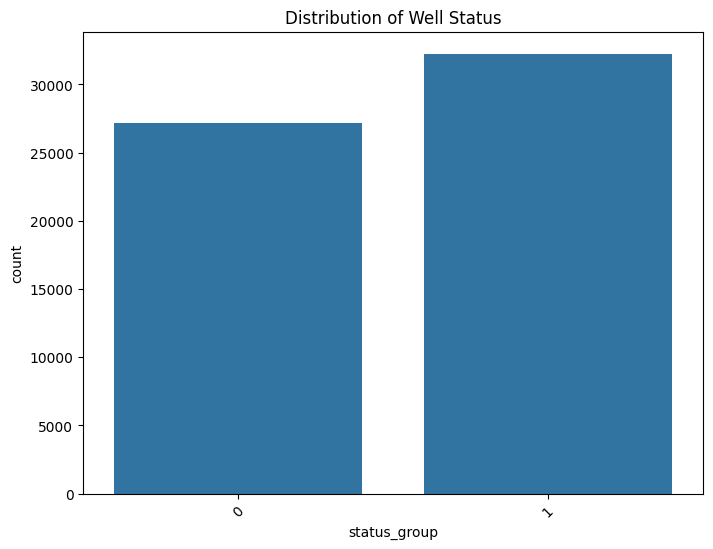
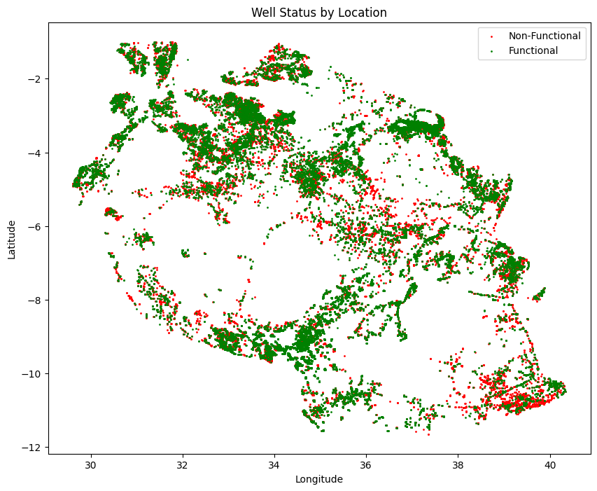
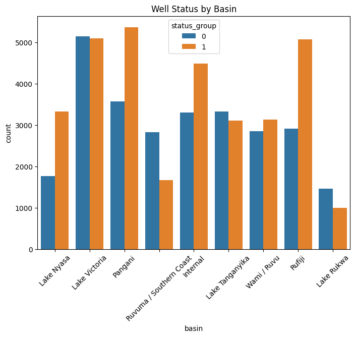
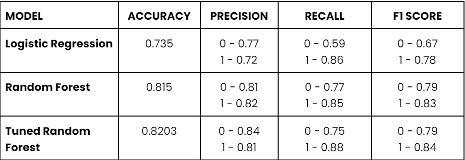

# Tanzanian Water Wells Analysis
Author: William Brandon Omballa

## Overview

The stakeholder will be the Tanzanian Government. The purpose of this project is to provide the Tanzanian Government with valuable insights on well status across the country to help in the allocation of resources, as well as a predictive model that can be used to make recommendations on wells that need to be repaired or will soon not be functional.

## Business and Data Understanding
The Government of Tanzania would like to ensure that all it's citizens have access to clean and adequate water.

Using the data collected by Taarifa, I would like to determine the key features that can be used to predict a well's condition hence make appropriate recommendations.

## Data & Methodology
The data used is collected by an organization called Taarifa. The scope of this project is to create a binary classification model.

However, the target column has 3 values: 
1. Functional
2. Functional needs repair
3. Non functional

To convert the data to binary form. We grouped Functional Needs repair and Non functional together to create two classes. Functional and Non Functional.

I believe that this approach is good as Functional Needs Repair wells will be flasgged as Non functional and this can aid in quick repairs to be done before the affected region has lost water completely. Also our model predicted it better as compared to making Functional Needs repair to the Functional class.

## Exploratory Data Analysis (EDA)
Here I would like to explore the dataset more so as to get an general understanding.

### Class Distribution

Here I was looking at the distribution of the target classes.
We can see that it is a normal distribution with each class almost equally represented.

### Well Distribution

This was to investigate if a certain part of the country had a higher probalibity of well being in one class or the other i.e If wells in a certain location are more prone to be Functional or Non functional. The image showed an even distribution again. The main reason why there are more green markers (Functional Wells) in the plot is because the non functional wells (Red markers) wer plotted first hence the green markers overlapped some red markers.

### Well Basin

In the dataset, each well is also marked by the basin it is found near. This can be a useful feature. I plotted the distribution of Functional wells and Non Functional Wells to the basin they are found near and see if there is a pattern. In most cases the the functional wells were more, apart from the Ruvuma / Southern Coast basin which has more non functional than fuctional wells. This might need to be investigated further.

## Modeling
With this data, it would be nice to create a predictive model that can evaluate the data and predict if a well is likely to be functional or not. This would enable resources to be efficiently distributed to wells that are almost non functional minimizing the time citizens spend without water. 

First the data was passed to a logistic Regression Model. The model had an accuracy of 73.5%. Not bad.

The second model I used is a Random Forest model. It is a much more complex model and the hope was that it could learn better and it did having an accuracy of 81.5%

Trying to build on the success of the Random Forest. I fine tuned the model hyperparameters to find the best values. Although this was successful. The model had an accuracy of 82.0%. A slight increase from the default model.

## Evaluation
Although the model accuracy is good, there is a general triend that the recall is relatively low as compared to other metrics.

This can be attributed to the way we converted our model from ternary to binary. We combined all Functional wells needs repair class to Non Functional. This can suggest that some of the features for these classes are different hence the model cannot learn well.

## Conclusion
Going forward, a model that is able to classify mutiple classes should be used instead of a binary approach. This might increase accuracy as well as the recall.

Also, emphasis should be kept on the features that the model found to be most useful.

